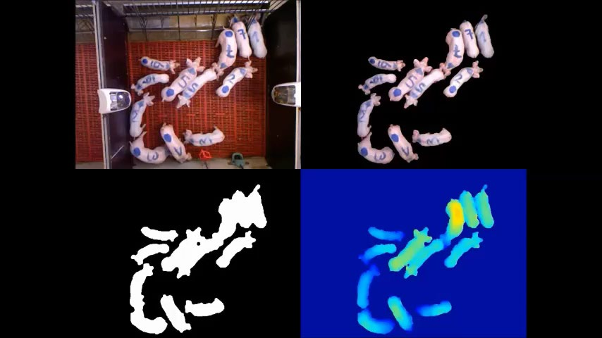
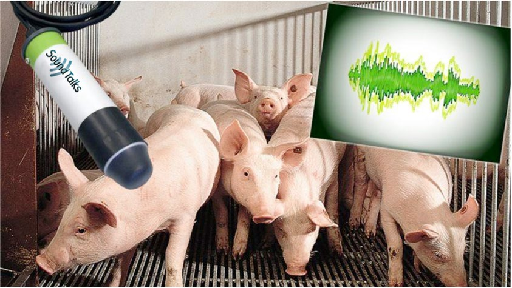
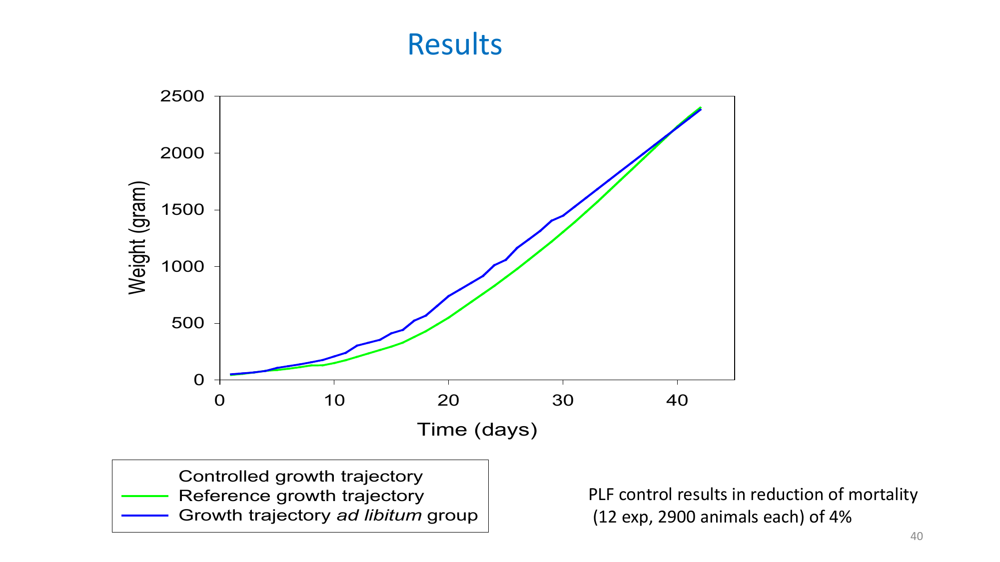

## O que é Zootecnia de Precisão?

:::: {.columns}

::: {.column width="55%"}
Aplicação de **sensores, dados e modelos quantitativos** ao manejo animal,
para tomar decisões no nível do **indivíduo** e não do lote inteiro.
:::

::: {.column width="35%"}
{fig-alt="Bovino da raça Nelore" width="100%"}
:::

::::

## O que é Zootecnia de Precisão?

- Extensão dos princípios da Agricultura de Precisão para a produção animal;
- Cada animal passa a ser monitorado continuamente (peso, comportamento, ambiente, saúde), tornando possível tomar decisões no nível do indivíduo.
- Decisões deixam de ser baseadas em médias do rebanho e passam a considerar a variabilidade entre indivíduos.

## Por que "de precisão"?

O manejo tradicional trata o lote como uma unidade só. Mas animais variam
entre si em taxa de crescimento, comportamento, resposta a estresse
térmico, risco de doença, entre outros.

::: {.lista-menor}
- **Eficiência**: menos desperdício de insumos (ração, água, energia)
- **Bem-estar animal**: detecção precoce de dor, estresse e doença
- **Sustentabilidade**: menor impacto ambiental por unidade produzida
- **Rastreabilidade**: identificação individual ao longo de toda a cadeia
:::

## Como isso é feito na prática

:::: {.columns}

::: {.column width="60%"}
::: {.font-menor}
- **Identificação eletrônica** (brincos RFID, chips, colares)
- **Sensores** de peso, temperatura, atividade, som, imagem (câmeras)
- **Coleta contínua de dados**, muitas vezes automática (sem intervenção humana)
- **Modelos e algoritmos** que transformam dado bruto em decisão
:::
:::

::: {.column width="40%"}
{fig-alt="Brinco de identificação em bovino" width="100%"}
:::

::::

## PLF na prática: monitoramento de agressão

::: {.attribution}
PLF = *Precision Livestock Farming* — em português, Pecuária (ou
Zootecnia) de Precisão
:::

:::: {.columns}

::: {.column .font-menor width="55%"}
Câmeras + algoritmo de visão computacional identificam comportamento
agressivo entre suínos automaticamente, sem observação humana constante.

**Acurácia: 89%**

*(KU Leuven, Umil-Itália, TIHO-Alemanha, Fancom-Holanda, 2014)*
:::

::: {.column width="45%"}
{fig-alt="Sequência de imagens mostrando suínos e o algoritmo de detecção de agressão segmentando os animais" width="100%"}
:::

::::

## PLF na prática: detecção precoce de doença

:::: {.columns}

::: {.column .font-menor width="55%"}
Sensores de som captam a tosse dos animais continuamente. Um aumento no
índice de tosse **antecipa** sinais de infecção respiratória, permitindo
tratar antes que os animais adoeçam visivelmente.

*(Projeto EU-PLF, SoundTalks + Boehringer-Ingelheim)*
:::

::: {.column width="45%"}
{fig-alt="Suínos em baia com sensor de som SoundTalks e visualização de uma onda sonora" width="100%"}
:::

::::

## PLF na prática: controle preditivo do crescimento

:::{.font-menor}
Em frangos de corte, um modelo preditivo ajusta a oferta de ração ao
longo do tempo em vez de deixar o animal comer *ad libitum*.
:::

{fig-alt="Gráfico comparando a trajetória de crescimento controlada, de referência e do grupo ad libitum ao longo de 42 dias" fig-align="center"}

::: {.attribution}
Redução de 4% na mortalidade (12 experimentos, ~2.900 animais cada) —
Fonte (3 slides): Berckmans, D. (2022). *Why Precision Livestock Farming
will create a more sustainable livestock sector.* 4th International
Huvepharma Seminar, Penang, Malásia.
:::

## Visão geral da disciplina

:::: {.columns}


A ementa está organizada em quatro grandes blocos, do dado bruto até a
aplicação prática:

::: {.incremental}
1. **Coleta e administração de dados** — como registrar e organizar
   informações da produção animal
2. **Identificação eletrônica** — rastreabilidade e estudo do comportamento
   individual
3. **Sensores e modelagem** — extração de conhecimento, modelos
   preditivos, simulação (ex: climatização)
4. **Aplicações** — como tudo isso se conecta às diferentes cadeias de
   produção animal
:::


::::

## Exemplo: curva de crescimento e ponto de abate

Bovinos não crescem em linha reta: o peso segue uma curva que acelera,
desacelera e se aproxima de um **platô** (o peso à maturidade). Modelos
como o de **Gompertz** descrevem bem esse comportamento.

## Exemplo: curva de crescimento e ponto de abate

:::: {.columns}

::: {.column width="60%"}
```{python}
import numpy as np
import pandas as pd
import matplotlib.pyplot as plt

# Modelo de Gompertz: W(t) = A * exp(-B * exp(-k*t))
#   A = peso à maturidade (o "platô" da curva)
#   B = ajusta o peso ao nascimento
#   k = taxa de maturação
# Parâmetros ilustrativos, na faixa reportada na literatura para bovinos
# de corte (peso adulto ~650 kg; ver notas da aula para as referências)
A, B, k = 650, 3.08, 0.004
idade = np.arange(0, 900)
peso = A * np.exp(-B * np.exp(-k * idade))

df = pd.DataFrame({"idade_dias": idade, "peso_kg": peso})

# ponto de inflexão do modelo de Gompertz: ocorre em W = A/e (~36,8% do
# peso adulto) — é onde o ganho de peso DIÁRIO é máximo
peso_inflexao = A / np.e
idade_inflexao = idade[np.argmin(np.abs(peso - peso_inflexao))]

# faixa ilustrativa de abate: entre 80% e 90% do peso adulto, equilíbrio
# comum entre crescimento muscular/ósseo e início da deposição de gordura
faixa_abate = (0.80 * A, 0.90 * A)

plt.figure(figsize=(8, 5))
plt.plot(df["idade_dias"], df["peso_kg"], color="tab:blue", label="Peso vivo")
plt.axhline(A, color="gray", linestyle=":", linewidth=1, label="Peso adulto (platô)")
plt.axvspan(
    idade[np.argmin(np.abs(peso - faixa_abate[0]))],
    idade[np.argmin(np.abs(peso - faixa_abate[1]))],
    color="tab:orange", alpha=0.2, label="Faixa usual de abate"
)
plt.scatter([idade_inflexao], [peso_inflexao], color="tab:red", zorder=5,
            label="Máximo ganho diário (inflexão)")
plt.xlabel("Idade (dias)")
plt.ylabel("Peso vivo (kg)")
plt.title("Curva de crescimento (modelo de Gompertz)")
plt.legend(fontsize=8)
plt.show()
```
:::
::: {.column .lista-menor width="40%"}
Depois da inflexão, o ganho diário desacelera e o custo por kg ganho
aumenta, por isso o abate costuma ser decidido **antes** do platô,
quando o animal atinge o acabamento mínimo exigido.
:::

::::


## Obrigado

Dúvidas? [davy.baia@ceca.ufal.br](mailto:davy.baia@ceca.ufal.br)
